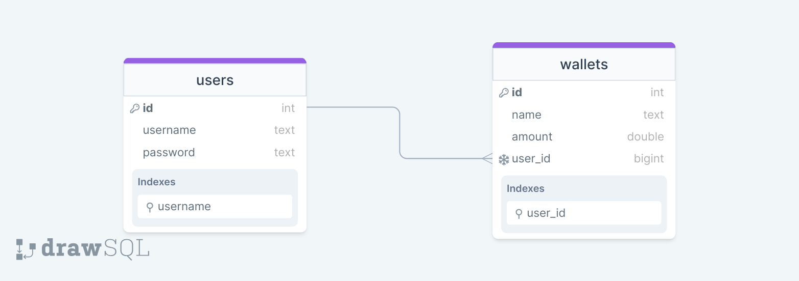

# Design Document

By moheshamm

Video overview: <https://youtu.be/lp3UqHoFjQE>

## Scope

In this section you should answer the following questions:

* What is the purpose of your database?
The purpose of this database is to act as the foundation for an SQLite Wallet App!
* Which people, places, things, etc. are you including in the scope of your database?
Users, which includes usernames and password
Wallets, which includes the wallet's name, the amount stored inside of it in dollars($), and the user which is associated with that wallet!
* Which people, places, things, etc. are *outside* the scope of your database?
Out of scope elements may include: The lack of a table that tracks transactions and processes, Transfering from a user's own wallet to another wallet he has in his own account.

## Functional Requirements

In this section you should answer the following questions:

* What should a user be able to do with your database?
So basically I've decided instead of letting the user run queries manually and get too deep into the weeds and fancy SQLite words; I decided to take the approach of abstracting everything away by implementing a user-friendly python program along with the help of CS50's Libary in Python and SQL module! A user should be able to Login, Create an account, or simply Exit a Program as provided by the base menu. If a user logs in; He is provided with 10 Services: Display Wallets, Deposit, Withdraw, Transfer To a User, Add Wallet, Delete Wallet, Change Password, Change Username, DELETE Account, and lastly Sign Out! All of this is automated by simply choosing the process and service number as asked by the program. Every service is automated and applied on to the database (wallet.db) automatically. Not only does it stop there, but every thing is checked: Usernames(If exist), Passwords, Wallet names(If exist), Sufficent funds in the Wallet, and more! If any of these checks are violated, every process undos like it never happend! To avoid logging in for every process, a user is simply asked a Yes OR No Question to continue. Yet in some cases if a check like in a password; a user may be signed out as a safety precaution. And Of course CRUD operations are supported!

* What's beyond the scope of what a user should be able to do with your database?
Not being able to track transactions history/logs whether its a deposit,withdraw,or transfer; Transfering from a user's own wallet to another wallet he has in his own account; and Selecting a currency.

## Representation
Entities are captured in SQLite tables with the following schema.

### Entities

The `users` table includes:

* `id`, which specifies the unique ID for the user as an `INTEGER`. This column thus has the `PRIMARY KEY` constraint applied.
* `username`, which specifies the user's username as `TEXT`, given `TEXT` is appropriate for username fields.
* `password`, which specifies the user's password as `TEXT`, given `TEXT` should be appropiate for password fields.

All columns in the `users` table are required and hence should have the `NOT NULL` constraint applied. No other constraints are necessary.

The `wallets` table includes:

* `id`, which specifies the unique ID for each wallet as an `INTEGER`. This column thus has the `PRIMARY KEY` constraint applied.
* `name`, which specifies the wallet's name as `TEXT`, given `TEXT` is appropriate for name fields.
* `amount`, which specifies the amount stored in that wallet as `NUMERIC`, since `NUMERIC` allows for the suitable conversions of numbers. Additionally there is a `CHECK` applied to ensure the amount doesn't go below an amount of zero.
* `user_id`, which is the ID of the user who is associated with that wallet as an `INTEGER`. This column thus has the `FOREIGN KEY` constraint applied, referencing the `id` column in the `users` table to ensure data integrity. Aswell as having `ON DELETE CASCADE` column constraint to have the benefit of automatically deleting the wallet in case a user is deleted.

All columns in the `wallets` table are required and hence should have the `NOT NULL` constraint applied. No other constraints are necessary.

### Relationships

The below entity relationship diagram describes the relationships among the entities in the database.

Or to provide a link would be better: https://drawsql.app/teams/elziats-team/diagrams/cs50sql-final-project

* The relationship between the `users` table and `wallets` table is a One-To-Many Relationship, Where each each user can have zero or more wallets ;Meanwhile, a wallet can only belong to only one user.

## Optimizations

Per the typical queries in `queries.sql`, it is common for users of the database to access most of their services using their username and their wallet's corresponding user_id. For that reason, indexes are created on the `username`, and `user_id` columns to speed up the process.

## Limitations

In this section you should answer the following questions:

* What are the limitations of your design?
* What might your database not be able to represent very well?

User interface may not be at a professional or an actual application level since it's a terminal based application accessed through a python program. Usernames and Wallet names may be repeated ,thus having multiple users having the same username/wallet name which may interfere with the queries (Which is not assessed in this version with a `UNIQUE` Column constraint nor a `ValueError` condition in the python program) leading to unexpected results. Deposits are allowed with any amount with no restrictions which could allow someone to maliciously interfere and insert a really large number to cause some errors in the database and program. Python Code may have been cleaner if I had prior knowledge of python methods/functions to implement a method that is being reused over and over, leading to a cleaner code structure and fewer lines of code(570 lines of code!).{May revist the project's code and try to clean it up if i take a python course like CS50Python in the future!}. Neither TRIGGERS nor VIEWS were used in this version of the program. When changing username or password, You can use the old ones and process will still work which will affect the login process aswell.
